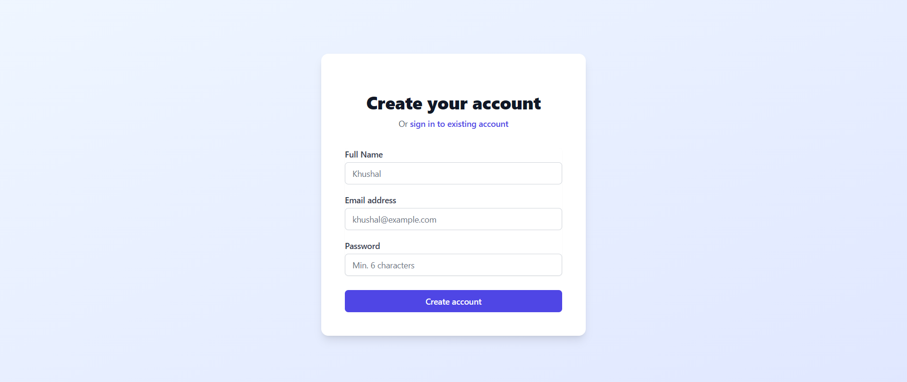

# Mini Project Manager

A full-stack project management application built with a React frontend and a .NET Core backend. This tool allows users to register, log in, create projects, and manage tasks within those projects.

## Live Demo

* **Frontend (Vercel):** `https://mini-project-manager-ou11.vercel.app`
* **Backend API (Render):** `https://mini-project-manager-ltr7.onrender.com`

---


## Screenshots





---

## Features

* **User Authentication:** Secure user registration and login using JWT (JSON Web Tokens).
* **Project Management:** Users can create, view, update, and delete their projects.
* **Task Management:** Within each project, users can add, edit, delete, and toggle the completion status of tasks.
* **Task Scheduler:** A simple scheduler to help organize and prioritize tasks.

---

## Tech Stack

This project is built with a modern tech stack, separating the frontend and backend for a clean, scalable architecture.

| Area | Technology | Description |
| :--- | :--- | :--- |
| **Frontend** | React, TypeScript, Vite | A fast, modern UI built with components. |
| **Styling** | Tailwind CSS | A utility-first CSS framework for rapid UI development. |
| **Backend** | .NET 8 (C#) | A high-performance, cross-platform framework for building the web API. |
| **Database** | PostgreSQL & EF Core | Uses PostgreSQL as the database, with Entity Framework Core as the ORM. |
| **API Client** | Axios | A promise-based HTTP client for making API requests from the frontend. |

---

## Deployment

This application is fully containerized and deployed on modern cloud platforms:

* **Frontend (Vercel):** The React application is deployed to Vercel, providing a fast, global CDN.
* **Backend (Render):** The .NET API is containerized using Docker and deployed as a web service on Render.
* **Database (NeonDB):** A serverless PostgreSQL database hosted on NeonDB.

---

## How to Run Locally

To get this project running on your local machine, follow these steps.

### Prerequisites

* .NET 8 SDK
* Node.js (v18+)
* A local PostgreSQL database (or a connection string from a cloud provider like NeonDB)

### Backend Setup

1.  Navigate to the backend directory:
    ```bash
    cd backend/MiniProjectManager
    ```
2.  Restore the .NET packages:
    ```bash
    dotnet restore
    ```
3.  Set up your secrets. Create an `appsettings.Development.json` file in this directory. Add your database connection string and a secure JWT key.
    ```json
    {
      "ConnectionStrings": {
        "DefaultConnection": "YOUR_POSTGRESQL_CONNECTION_STRING"
      },
      "Jwt": {
        "Key": "YOUR_SUPER_SECRET_KEY_AT_LEAST_32_CHARS_LONG",
        "Issuer": "MiniProjectManager"
      }
    }
    ```
4.  Run the database migrations:
    ```bash
    dotnet ef database update
    ```
5.  Run the application:
    ```bash
    dotnet run
    ```
    The API will be running on `http://localhost:5004`.

### Frontend Setup

1.  Navigate to the frontend directory:
    ```bash
    cd frontend
    ```
2.  Install the npm packages:
    ```bash
    npm install
    ```
3.  Create an environment file. Copy the `.env.example` to `.env` (or just create `.env`) and add the API URL.
    ```
    VITE_API_URL=http://localhost:5004/api
    ```
4.  Run the application:
    ```bash
    npm run dev
    ```
    The frontend will be running on `http://localhost:5173`.